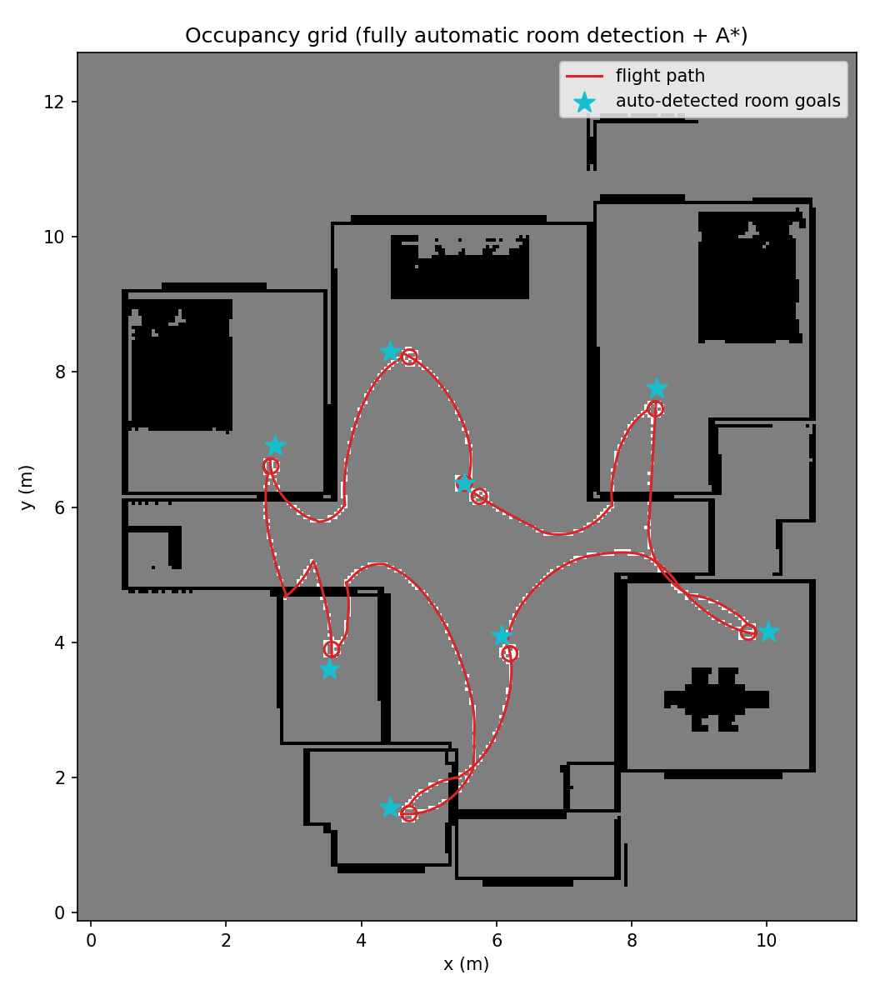

# NaviDrone: Autonomous Indoor Exploration

**Autonomous indoor drone navigation, exploration, and vision-based SLAM, simulated in PyBullet.**

<p align="center">
  
  
  
  
  
</p>

A quadrotor is dropped into a full house (loaded from any GLB 3D model, no code changes needed) and explores it completely **on its own**: it figures out where it's starting from, finds every room, plans a route between them, flies it while dodging obstacles in real time, and builds a drift-corrected 3D map of everything it saw, all from a simulated onboard RGB-D camera, no GPS or motion capture.

No hand-picked waypoints. No house-specific tuning. Point it at a new house file and it works out the rest itself.

---

## 🎬 Demo

Simulation flight:


Onboard colorized depth view (what `control/collision_avoidance.py` and VO effectively "see" as distance, not raw color): warm/red is close, cool/blue is far, clipped to 0.1-6m so room-scale distances actually spread across the colormap instead of bunching up:


Final point-cloud map:


2D top-down occupancy grid, built live from the drone's own sensed depth data (not the ground-truth grid used for planning): black is a detected obstacle (wall or furniture the camera actually saw), gray is space the drone's sensor never covered, the red line is the flown flight path, and the cyan stars are the auto-detected room goals. The small loops in the path at each star are where the drone paused for its 360° scan:



---

## ✨ Features

- 🧠 **Vision-based SLAM**: ORB feature-based visual odometry with depth-based PnP pose estimation, keyframe selection, loop-closure detection, and pose-graph optimization (Huber-robust least-squares) to build a drift-corrected 3D point-cloud map.
- 🗺️ **Fully automatic exploration**: an occupancy grid is built directly from the house's known geometry, rooms are auto-detected via a distance-transform "roomiest point" search, and A* plans routes between them (with line-of-sight path simplification).
- 🛑 **Reactive flight control**: velocity-level drone control with proximity-based braking, stuck/oscillation detection, and automatic escape maneuvers, so the drone recovers from tight corners and near-misses instead of getting stuck or crashing.
- 🏠 **Generalizes to any house**: auto-derives world bounds, ceiling detection, start position, and room goals from whatever GLB is loaded; nothing is hardcoded to one floor plan.
- 🎚️ **Live-tunable controls**: cruise speed and braking clearance can be adjusted mid-flight from sliders in the PyBullet GUI, no restart needed.

---

## 🧩 How it works: the pipeline

Everything below runs from a single entry point, `test_auto_explore.py`, in this order:

### 1. House loading
`env/house_world.py` (`HouseWorld`) loads `env/assets/house/house_visual.obj` (rendering) and `house_collision.obj` (physics, concave trimesh) as a static body, and exposes `get_bounds()` (via `p.getAABB()`) so the occupancy grid can be auto-sized to whatever house is loaded, no hardcoded dimensions.

### 2. Occupancy grid construction (ground truth)
`slam/occupancy_grid.py` (`OccupancyGrid.build_from_known_geometry`) fires one vertical raycast per grid cell (batched via `p.rayTestBatch`) between `z=0.05m` and `z=1.9m`. This **must** run before the drone spawns, otherwise the drone's own body sits on the start cell and corrupts the free-space read (this previously caused room detection to silently find zero rooms).

### 3. Auto start-position + room-goal detection
`slam/room_detection.py` runs a distance-transform "roomiest point" search: for every free cell, compute distance to the nearest wall, pick the farthest point, suppress a radius around it, repeat. Any connected free-space component that touches the grid's outer border is excluded first, since real interior space should never reach the padded safety margin. If it does, it means an exterior wall leaked through the raycast and would otherwise dominate the search.

### 4. Route planning
`slam/path_planning.py` (`AStarPlanner`) plans an 8-connected A* route between each consecutive goal (with obstacle inflation), simplified via Bresenham line-of-sight shortcutting. Goals themselves are ordered with a greedy nearest-neighbor heuristic (not a true TSP solve). The legs are chained into one waypoint list, with `scan_indices` marking which stops trigger a 360° scan.

### 5. Flight execution
`control/scripted_flight.py` (`WaypointController`) is a proportional pursuit controller (turn-then-forward) with stuck-detection based on **progress toward the target** (not raw displacement, so oscillating near a wall doesn't fool it) and an escape-maneuver recovery system. `control/collision_avoidance.py` casts a forward ray every step and brakes proportionally as an obstacle nears, running *alongside*, not instead of, the escape system.

### 6. Perception + mapping (concurrent with flight)
- `slam/visual_odometry.py`: ORB features + ratio test + depth-based PnP (`solvePnPRansac`), seeded with the drone's true starting camera pose. Runs independently of the saved map (see [Notes](#-notes)).
- `slam/loop_closure.py`: keyframe-to-keyframe ORB matching + PnP, rejecting closures that disagree too much with VO's own drift estimate (guards against false-positive matches between similar-looking but distant spots).
- `slam/pose_graph.py`: `scipy.optimize.least_squares` with Huber-robust loss over sequential + loop-closure edges (no g2o/GTSAM dependency).
- `slam/mapping.py`: voxel-downsampled point cloud, backprojected from RGB-D using the **ground-truth** camera pose.

### 7. Output
On completion: `results/occupancy_grid_auto.png` (2D top-down map), `results/house_map_auto.ply` (merged 3D point cloud), then an Open3D viewer opens showing the final map (blocks until closed).

---

## 📁 Project structure

```
Drone-Nav_research/
├── test_auto_explore.py       # Main entry point, the full autonomous exploration run
├── env/                        # Simulation world + drone
│   ├── house_world.py           # HouseWorld: loads the house mesh, exposes get_bounds()
│   ├── drone_robot.py           # DroneRobot: kinematic control, camera, pose
│   ├── sim_world.py              # Earlier procedural box-obstacle room (standalone, not used by main pipeline)
│   ├── assets/
│   │   ├── house/                  # Converted house mesh + baked textures (generated)
│   │   └── quadrotor.urdf          # Custom drone visual model (body, arms, propellers, marker)
├── control/                    # Flight control
│   ├── scripted_flight.py        # WaypointController: pursuit control, stuck/escape recovery, scans
│   ├── collision_avoidance.py    # apply_braking() : forward raycast braking
│   └── teleop.py                  # Manual keyboard flight (dev/testing tool)
├── slam/                       # SLAM + planning stack
│   ├── occupancy_grid.py         # OccupancyGrid: ground-truth + sensed grids, traversable mask
│   ├── room_detection.py         # find_start_position, find_room_goals
│   ├── path_planning.py          # AStarPlanner
│   ├── visual_odometry.py        # VisualOdometry: ORB + PnP pose estimation
│   ├── loop_closure.py           # Keyframe loop-closure detection
│   ├── pose_graph.py              # Pose-graph optimization (Huber-robust least-squares)
│   └── mapping.py                 # PointCloudMapper, show_point_cloud
├── perception/
│   └── camera_model.py            # get_intrinsics() : camera K matrix from FOV/resolution
├── scripts/
│   └── convert_house_glb.py       # One-time GLB to OBJ conversion (visual + collision + textures)
├── config/                     # YAML configs (see below)
├── 3d Model/
│   └── room.glb                    # Source house model (original design, no licensing restriction)
├── results/                     # Saved maps, occupancy grids, demo GIFs (generated, not hand-authored)
├── requirements.txt
├── project_context.json        # Machine-readable project manifest (see below)
└── drone_nav_research_plan.md   # Original research plan / motivating questions
```

---

## ⚙️ Setup

Requires **Python 3.12** (tested version).

```bash
pip install -r requirements.txt
```

Dependencies: `pybullet`, `numpy`, `scipy`, `opencv-python`, `open3d`, `pyyaml`, `matplotlib`, `trimesh`, `pillow`.

### 🪟 Windows note: installing `pybullet`

On Ubuntu, `pip install pybullet` just works (it has prebuilt wheels). On Windows, `pip` often has to compile it from source, which fails unless the right C++ build tools are present. If `pip install -r requirements.txt` fails on the `pybullet` step:

1. Install [Visual Studio](https://visualstudio.microsoft.com/downloads/) (the Community edition's installer works fine, you don't need the full IDE).
2. In the Visual Studio Installer, check the **"Desktop development with C++"** workload, then under its optional components install only:
   - MSVC Build Tools for x64/x86 (Latest)
   - C++ CMake tools for Windows
   - Windows 11 SDK (10.0.26100.8249) (keep just one SDK version installed)
   - C++ core desktop features (checked by default with the workload, leave as-is)
3. Re-run `pip install -r requirements.txt`.

---

## ▶️ Usage

```bash
python test_auto_explore.py
```

This opens a PyBullet GUI window and flies the full auto-planned route: detecting rooms, visiting each with a 360° scan, avoiding obstacles reactively, and building a merged point-cloud map. At the end it saves the occupancy grid and point cloud to `results/`, then opens an Open3D viewer of the final map (close the window to exit).

**Requires a display**: this doesn't run headless by default. Set `sim.gui: false` in `config/house_config.yaml` to run in PyBullet `DIRECT` mode instead (no visualization, no GUI sliders, but faster and scriptable). Note: the final `show_point_cloud()` step still opens an Open3D window regardless of this setting.

### 🎚️ Live GUI controls

While it's running, the GUI's **"Params"** panel exposes three sliders, read live every physics step:

| Slider | Range | Effect |
|---|---|---|
| Cruise speed (m/s) | 0.3 to 3.0 | `drone.max_linear_speed` |
| Braking distance (m) | 0.3 to 2.5 | forward-braking trigger distance |
| Min safe distance (m) | 0.1 to 1.0 | closest allowed approach before hard braking |

### 🖥️ Debug panels

| Panel | What it is |
|---|---|
| Synthetic Camera RGB / Segmentation Mask | PyBullet's own built-in preview panels (top-left), kept enabled |
| Drone Depth (colorized) | Custom `cv2` window, real linear metric depth in meters, JET colormap (near = warm/red, far = cool/blue), clipped to 0.1-6.0m. Replaces PyBullet's low-sensitivity built-in depth preview |
| Params | Live-tunable sliders (see above) |

To stop early, just close the PyBullet window (caught via `except p.error` in the main loop).

---

## 🏚️ Using a different house

The included house (`3d Model/room.glb`) is a custom model, converted once into the OBJ/texture files PyBullet actually loads (`env/assets/house/`). To swap in a different house:

```bash
python scripts/convert_house_glb.py path/to/your_house.glb
```

This regenerates everything in `env/assets/house/`: visual mesh, collision mesh, and a baked material texture atlas (PyBullet ignores flat Kd colors without a texture map, so every material's color gets baked into one small shared texture atlas, see [Known issues & fixes](#-known-issues--fixes) for why it has to be *one shared* atlas). Ceiling detection, world bounds, start position, and room goals are all re-derived automatically from the new geometry; no other changes are needed. Just run `python test_auto_explore.py` again afterward.

If you don't have a house model of your own, leave `3d Model/room.glb` as-is, conversion isn't needed to run the included demo (it's already converted).

---

## 🔧 Configuration

| File | Used by | Covers |
|---|---|---|
| `config/house_config.yaml` | `test_auto_explore.py` | Drone start pose/speeds, camera intrinsics, sim timestep + GUI toggle |
| `config/slam_config.yaml` | `test_auto_explore.py` | VO/PnP/RANSAC tuning, keyframe thresholds, mapping resolution, loop-closure thresholds, occupancy grid params, room-detection tuning, pose-graph weights |
| `config/flight_controller.yaml` | `control/scripted_flight.py` | Proportional gains, arrival radius, stuck/escape recovery tuning, 360° scan speed/duration |
| `config/env_config.yaml` | **Not used** by the main pipeline, leftover from the earlier procedural box-obstacle room (`env/sim_world.py`), kept for reference |

A few values worth knowing about:
- `drone.start_position` in `house_config.yaml` is a fallback only, it's overwritten at runtime by the auto-picked start position.
- `occupancy_grid.x_min/x_max/y_min/y_max` in `slam_config.yaml` are placeholders, overwritten at runtime from `house.get_bounds()` plus a margin.

---

## 🙏 Acknowledgements

A note on how this was built: I used Claude Code throughout development, for structuring modules, writing documentation/comments, and helping debug some of the trickier issues. The architecture, testing, and iteration were human (me). AI was a tool in the process.
